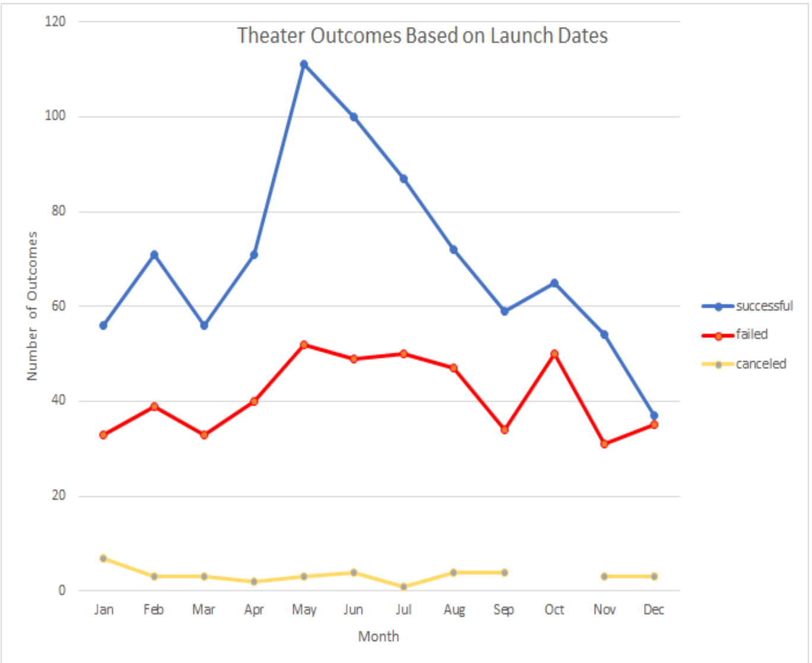

# Kickstarter Challenge Analysis

## Overview/Purpose

Louise is looking to start a kickstarter campaign to fund her theater project.  She is hopeful that looking at the data in different ways will give her some insights into how, when, and where she should begin asking for money.  If Louise is able to successfully analyze the data and create a strategy based on that analysis, 
her chances of having a successful campaign improve dramatically.

## Analysis and Challenges

### Analysis of Outcomes Based on Launch Date
I performed an outcomes based on launce date anaylsis by creating a pivot table of the needed data.  I formed the table by putting the date created into rows and the outcomes into the columns.  The goal of this chart was to present and analyze the data based on what part of the year might be best to begin a campaign. Next, I placed the outcomes in the summation field.  This was done to count the number of successful, failed, and canceled campaigns from each time period.  I removed the years and quarters filters from the row field to leave myself with months.  Lastly, I placed parent category and years into the filters.  This was done so that I could look, in this case, at only the campaigns that dealt with the theater.

## Conclusions Based on Launch Date
After completing the pivot table and subsequent line graph I was able to conclude that the months of May, June, and July seem to be the months that have the biggest increase in successful kickstarter campaigns.  I would advise Louise to begin her kickstarter in May.  I would also advise her to avoid beginning a campaign in the months of November and December as the graph shows a decline in the number of successful campaigns.

### Analysis of Outcomes Based on Goals
I also created an analysis based on the goal amount of money each person asked for.  I began by creating a spreadsheet to observe the success rate of compaigns with different amounts of money being asked for.  I then used CountIfs functions to help count the number of plays that were successful, failed, or canceled for 12 different ranges of money.  For example, I used the following code: =COUNTIFS(Kickstarter!$D:$D,">=1000",Kickstarter!$F:$F,"successful",Kickstarter!$D:$D,"<5000", Kickstarter!$R:$R, "plays") to count the number of plays that successfully made their goal amounts.  After repeating a similar line of code for failed and canceled campaigns, I then used the sum function to find the total number of plays with that goal.  I used this sum to help find the percentage of successful, failed, and canceld campaigns for each goal range.  Finally, I created a line graph to show the data in a more appeasing way.

## Conclusions Based on Goals
This data shows an interesting trend.  It shows that the more money you ask for, the less successful you are until you hit about 30000 dollars.  The success rate then jumps almost back to the less than 1000 percent before quickly declining again.  This is most likely caused by the lack of data in the upper ranges.  I do not think enough data exists to claim that the jump is anything other than a coincidence.  The success rate for Louise, who is looking for 10000 dollars, is 54%.  
![Outcomes_Vs_Goals]

### Challenges
My biggest challenges were with formating the graphs.  It took me awhile to get the Goals graph to look appropriate.  Even now, I feel there may be a better way to present that data. Louise biggest challenge will be trying to decide which information is pertinent and which information is not needed for her to be successful.  There may be other categories of data that could be beneficial for her.

### Final Thoughts
After completing both outcomes there are several things I would do to make the data more meaningful.  First I would try and create another Outcomes based on Goals sheet that also includes the month we would hopefully be starting in.  I'm guessing the percent successful in that month will increase dramatically for different money amounts.  The amount Louise needs to start  the play will not change, but when she starts it can.  Louise could possibly try to start several campaigns at the same time (or in 3 different months) to reach her 10000 goal.  This is something the data does not show.  Would starting a new campaign each month help or hurt her cause?
